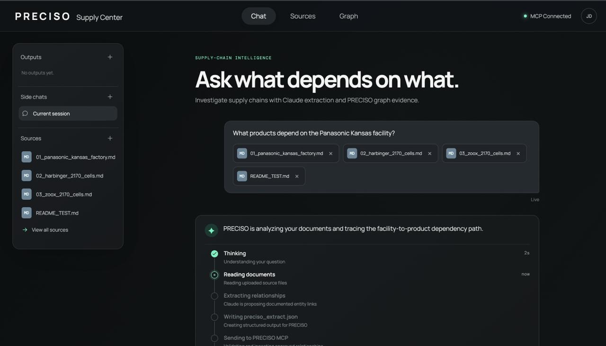
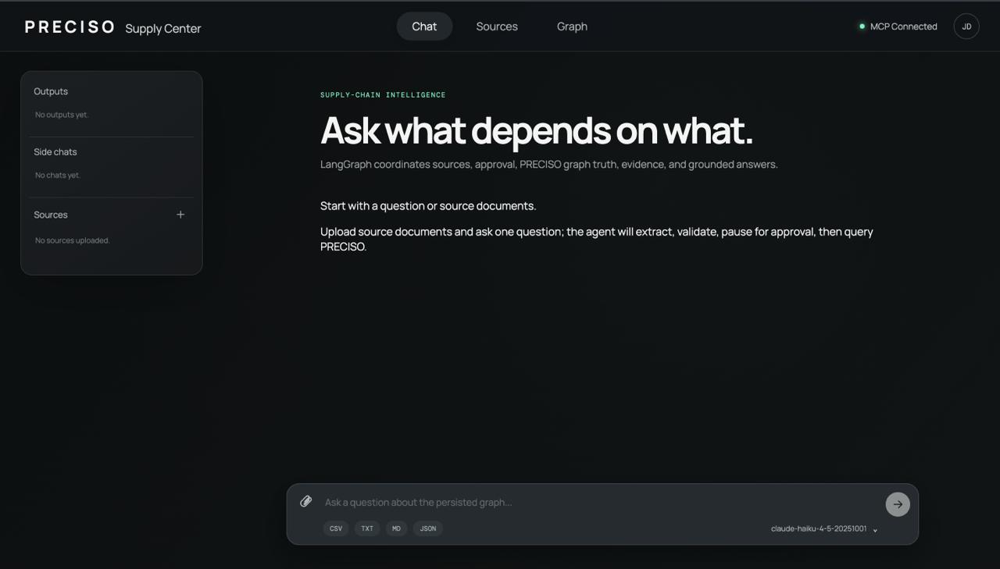

<div align="center">
  <h1>PRECISO Supply Center</h1>
  <p><strong>Evidence-backed supply-chain intelligence from your documents.</strong></p>
  <p><em>Ask what depends on what, then review the proposed graph before it persists.</em></p>
  <p>
    
    
    
    
  </p>
</div>

---

Most document assistants retrieve passages. Supply Center creates a reviewable
knowledge-graph proposal from each source, validates it with PRECISO, and only
persists it after a human approves the change. Follow-up questions query the
local graph rather than resending the original documents.

```text
Source documents -> Claude extraction -> PRECISO validation -> human approval
-> local graph + evidence -> grounded answer
```

The repository bundles PRECISO GraphRAG at
[`710ba66d929fa85b449e6ba256dcbd04f7e891c9`](engine/PRECISO_VERSION). Supply
Center is the application layer; PRECISO remains the authority for validation,
graph persistence, vector retrieval, and evidence.

## Quickstart

### 1. Prerequisites

- Python 3.11 or later
- Node.js 20 or later
- [Ollama](https://ollama.com/) with the `mxbai-embed-large` embedding model
- An Anthropic API key for Claude extraction, repair, and answer synthesis

```bash
ollama pull mxbai-embed-large
```

### 2. Install the application and bundled engine

```bash
git clone https://github.com/Preciso-GR/preciso-supply-chain-agent.git
cd preciso-supply-chain-agent

python3 -m venv .venv
.venv/bin/pip install -e '.[dev]'

python3 -m venv engine/preciso-graphrag/.venv
engine/preciso-graphrag/.venv/bin/pip install -e engine/preciso-graphrag

cp .env.example .env
```

Set `ANTHROPIC_API_KEY` in `.env`. The default configuration starts the bundled
MCP launcher automatically; no separate PRECISO checkout or absolute
`PRECISO_MCP_CWD` is required.

### 3. Start Supply Center

In one terminal:

```bash
.venv/bin/supply-center-api
```

In another terminal:

```bash
cd web
npm install
npm run dev
```

Open the URL printed by Vite, normally `http://localhost:5173`.

> PRECISO uses Ollama embeddings by default. Without Ollama, the engine can
> start in a degraded fallback mode, which is useful for plumbing checks but not
> for evaluating retrieval quality.

### Before You Upload Sources

Review the documents before giving them to the application. Structural
validation can catch invalid extraction shape, but it cannot prove a source is
accurate, current, complete, or the correct version.

- Remove drafts, duplicates, and superseded documents.
- Keep the reviewed source corpus if the graph must be reproducible.
- Treat model output as a proposal until it passes validation and human review.
- Do not approve an extraction whose source provenance or temporal claims are
  unclear.

Correcting an already-ingested source may require a deliberate graph correction
workflow, so a careful review before approval is cheaper than cleanup later.

## Use It

1. Upload Markdown, text, CSV, or JSON source documents in the browser.
2. Ask a supply-chain question, such as: `What products depend on Panasonic Energy's 2170 battery cells?`
3. Watch the live workflow: source read, extraction, validation, and any bounded repair.
4. Review the validated per-source extraction summary.
5. Select **Approve & build graph** to persist the reviewed artifacts, or
   **Reject** to leave the graph unchanged.
6. Read the grounded Markdown answer and ask follow-up questions against the
   persisted graph.

<p align="center">
  
</p>

<p align="center">
  
</p>

## How It Works

```text
                    Browser UI
        source upload, chat, approval, Markdown answer
                           |
                       HTTP / SSE
                           v
                    FastAPI application
          source store, artifact store, API contract
                           |
                           v
                  LangGraph state machine
  status -> intent -> extract -> validate -> repair -> approval
                           |
                       MCP over stdio
                           v
             Bundled PRECISO GraphRAG engine
  validation -> ingestion -> graph/vector retrieval -> evidence
                           |
                           v
                data/preciso/supply_chain
```

The workflow is explicit and checkpointed:

| Step | Owner | What happens |
| --- | --- | --- |
| 1 | Browser | Persists each source and starts a chat run with source IDs. |
| 2 | LangGraph | Checks PRECISO health and classifies the turn. |
| 3 | Claude | Produces one proposed extraction artifact per new source. |
| 4 | PRECISO | Validates each artifact without mutating the graph. |
| 5 | Claude + LangGraph | Applies a bounded, targeted repair only when validation fails. |
| 6 | Human | Approves or rejects the validated artifacts through a LangGraph interrupt. |
| 7 | PRECISO | Ingests approved artifacts through `ingest_from_file`. |
| 8 | PRECISO + Claude | Queries persisted graph evidence and synthesizes the answer. |

### Workflow Guarantees

- One source produces one extraction artifact.
- The normal UI has a single graph-mutation path: approved `ingest_from_file`.
- Rejecting an approval resumes the run without ingestion.
- Follow-up turns use persisted source IDs; raw source content is not resent by default.
- Startup verifies the real bundled MCP tool contract before serving requests.
- Browser answer Markdown is sanitized before display.

## Folder Contract

```text
engine/preciso-graphrag/    bundled PRECISO engine source
engine/PRECISO_VERSION      exact upstream engine revision
data/preciso/supply_chain/  graph, vectors, evidence, and manifests
uploads/                    application-owned raw source records
.runtime/extractions/       extraction artifacts and LangGraph checkpoints
docs/                       architecture reference and README assets
web/                        Vite browser application
```

Runtime directories are ignored by Git. The engine code is separate from graph
data, so application restarts preserve graph state without placing user data in
the vendored engine directory.

## MCP Runtime

Supply Center requires these PRECISO MCP tools at startup:

| Tool | Role in Supply Center |
| --- | --- |
| `get_server_status` | Verifies engine and embedding readiness. |
| `validate_extraction` | Validates a proposed extraction before approval. |
| `ingest_from_file` | Adds an approved, validated artifact to the graph. |
| `query_graph_tool` | Retrieves graph paths and evidence for a question. |

The browser receives live LangGraph execution events from
`/api/events/{run_id}` through Server-Sent Events. The answer view is ready to
render incoming answer events, although the current backend emits one completed
answer payload rather than provider token chunks.

## Supported Sources

| Format | Status |
| --- | --- |
| Markdown (`.md`) | Supported |
| Text (`.txt`) | Supported |
| CSV (`.csv`) | Supported |
| JSON (`.json`) | Supported |
| PDF, Office documents, URLs, OCR | Not implemented |

## Verification

```bash
.venv/bin/python -m pytest
.venv/bin/python -m ruff check src tests
cd web && npm run build
.venv/bin/python -m pip wheel . --no-deps --no-build-isolation -w /tmp/wheels
RUN_BUNDLED_MCP_INTEGRATION=1 .venv/bin/python -m pytest tests/test_bundled_mcp_integration.py
```

The bundled MCP integration test verifies discovery of the required MCP tools
and the package-safe runtime location. The full Panasonic browser acceptance
flow additionally requires a healthy Ollama model and Anthropic credentials.

## Current Limits

- This is a local, single-operator application, not a hosted multi-tenant service.
- The Graph tab is not yet a graph visualization or evidence explorer.
- Evidence payloads need further normalization before the UI can consistently
  show per-claim excerpts and reference links.
- Browser build verification exists; a dedicated browser end-to-end test suite
  does not yet.

## Docs

- [Current architecture, implemented scope, and roadmap](docs/ARCHITECTURE.md)
- [PRECISO version pin](engine/PRECISO_VERSION)
- [Bundled PRECISO GraphRAG documentation](engine/preciso-graphrag/README.md)
- [Attribution notice](NOTICE.md)
